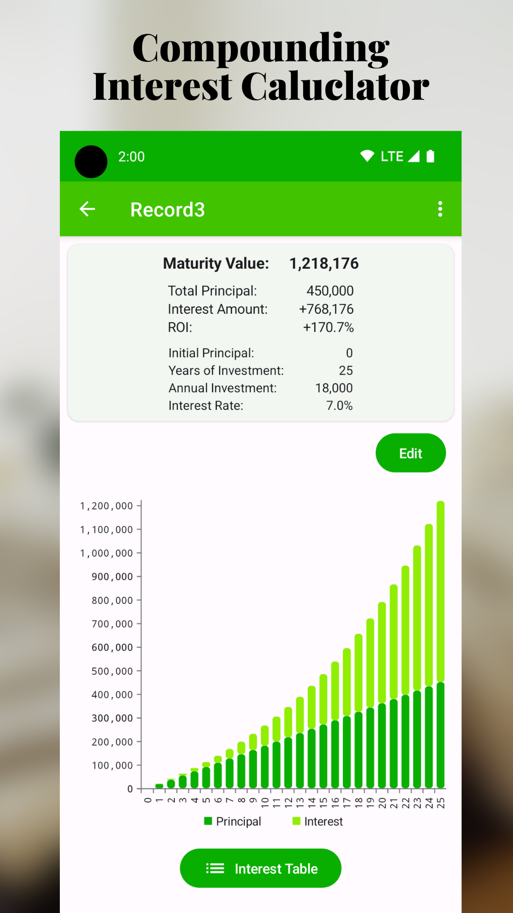
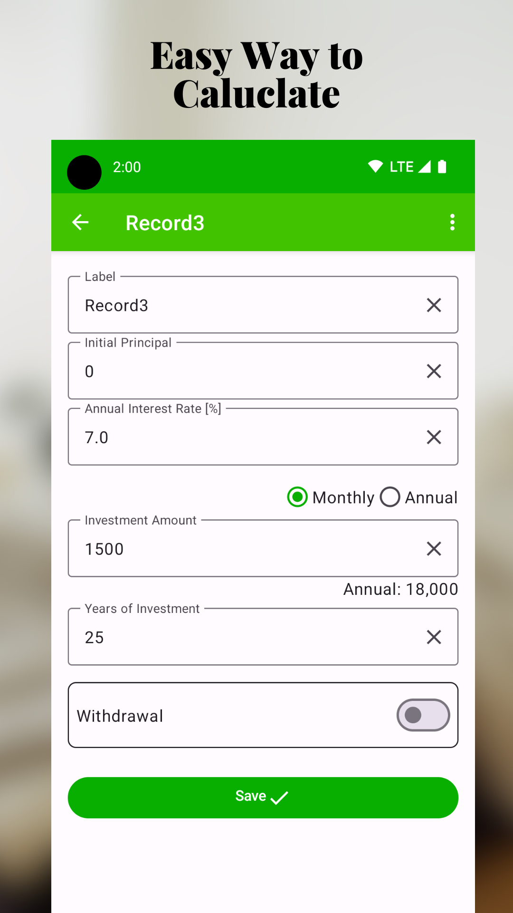
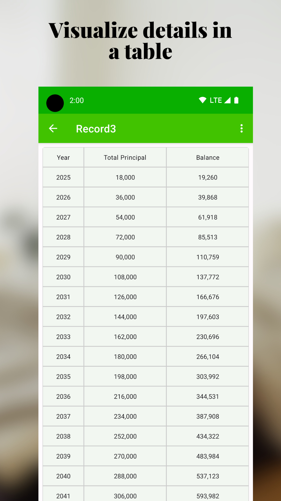
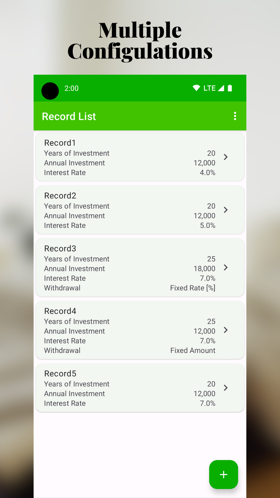
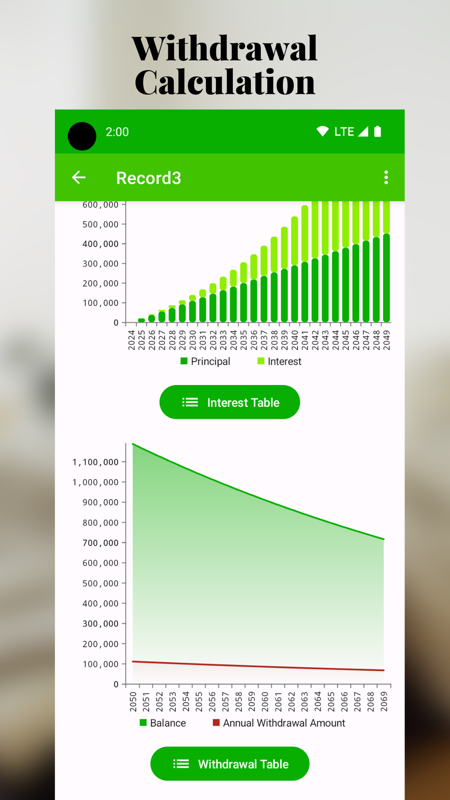

# Accumulate+: 

---

"Accumulate+" is the perfect app for those looking to steadily grow their assets through regular investment plans. Designed as a powerful compound interest calculator, it supports the comprehensive planning and execution of your investment strategy. By simply entering the principal amount, annual interest rate, regular contribution amount (monthly or annually), and the investment period, you can instantly visualize the long-term growth of your investments. With new features such as withdrawal simulation and the ability to display detailed annual projections including age and calendar year, you can craft an even more detailed financial plan.

### Key Features:

- Optimized for Regular Investing: Tailored features for easy simulation of regular investment strategies.
- Intuitive Interface: A clear and simple user interface that anyone can use effortlessly.
- Compound Interest Simulation: Instantly see the future growth of your assets and experience the power of long-term investing.
- Withdrawal Simulation: Plan for retirement by managing the entire lifecycle of your investment, including withdrawal strategies.
- Detailed Annual Projections: Track the progress of your investments with age and calendar year, bringing clarity to your future financial plans.
- Customizable: Set up flexible scenarios tailored to your investment goals for personalized planning.
- Educational Resources: Learn the basics of regular investing, including tips and strategies for effective asset growth.

### ScreenShots:

