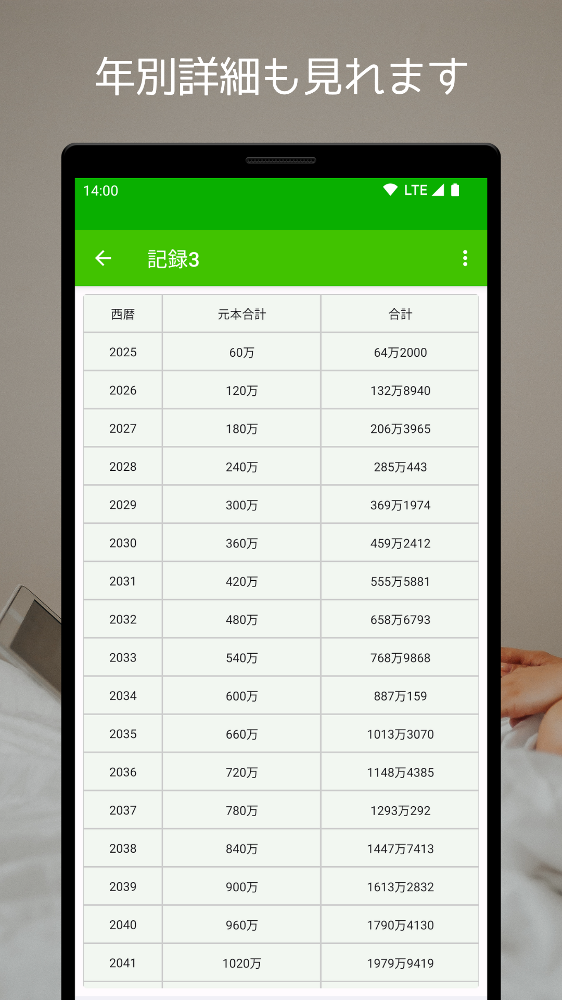
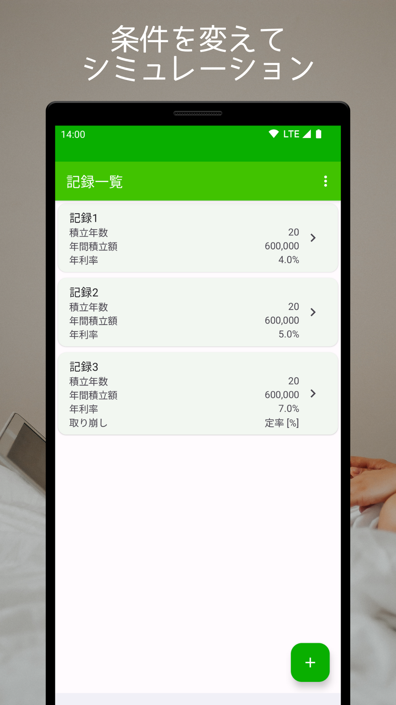

# 積立プラス

 

---

積立プラスは、積み立て投資を通じて資産を着実に増やしたい方や、新NISAやiDeCoなどの税制優遇制度を最大限活用したい方に最適なアプリです。
シンプルながらも強力な複利計算シミュレーターで、将来の資産成長を予測し、投資計画の立案から実行までを総合的にサポートします。
元本、年利率、積立額（月間または年間）、および積立期間を入力することで、長期的な資産運用の成果を明確に把握できます。
取り崩しシミュレーションと年齢・西暦を含む年別表示機能を活用し、より詳細な資産運用計画を立てることができます。

### 【主な特長】

- 積み立て投資特化: 新NISAやiDeCoを含む、積み立て投資に最適化されたシミュレーション機能
- 直感的操作: 誰でも簡単に利用できるクリアなユーザーインターフェイス
- 複利計算シミュレーション: 将来の資産成長を瞬時に確認し、長期投資のパワーを実感
- 取り崩しシミュレーション: 退職後の資産運用計画も含め、ライフプラン全体の管理が可能
- 年別詳細表示: 投資成果を年齢や西暦で確認し、未来の資産計画を具体化
- カスタマイズ可能: 自分の投資目標に合わせたシナリオ設定で、柔軟な計画策定

### スクリーンショット

---

<a href="/accumulate_plus/">English</a> | <a href="/ja/">ホームに戻る</a>

