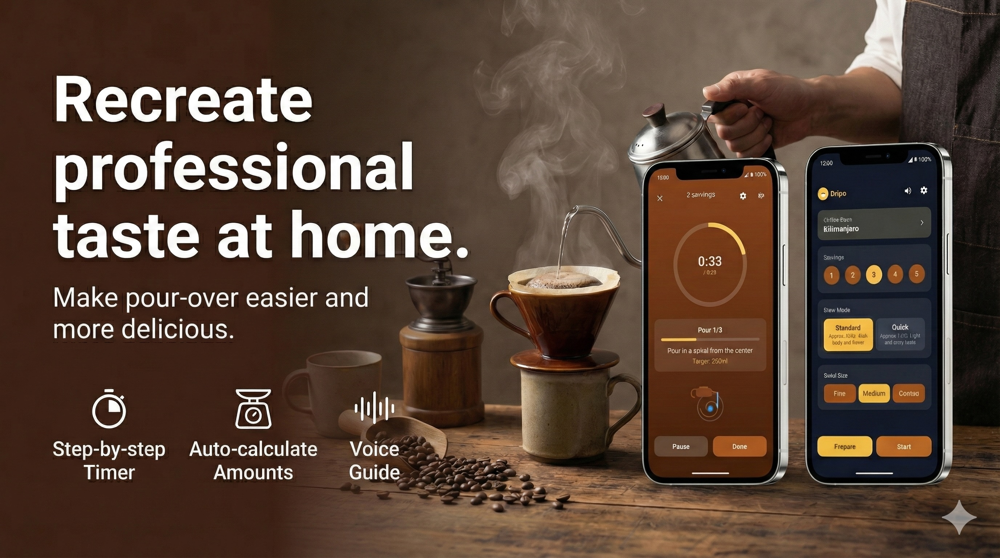

# Dripo: Pour-over Coffee Timer

---

## Consistency in Every Cup

**Dripo** is a step-by-step pour-over coffee timer designed to help you brew with repeatability and precision.
From blooming to the final pour, it guides your timing and water amounts with clear visuals, sound, and optional voice guidance—so your daily cup stays consistent.

Whether you are a beginner looking for guidance or an expert chasing the perfect extraction, Dripo adapts to your needs.

### Choose Your Style

*   **Standard Mode**: For a richer body and full flavor. Ideal for relaxing weekends.
*   **Quick Mode**: For a light, crisp taste. Perfect for busy mornings.

### Smart Calculations

Simply select your **Servings (1–5)** and **Grind Size (Fine/Medium/Coarse)**.
Dripo automatically calculates the optimal:
*   Coffee beans (g)
*   Water amount (ml)
*   Total brew time

---

## Key Features

*   **Step-by-step Timer**: Never lose your place. The app guides you through Blooming, Pours, and Drip Wait.
*   **Target Water Guidance**: Shows exactly how much to pour at each step to prevent over/under extraction.
*   **Voice Guide**: Hands-free prompts let you focus on pouring without staring at the screen (Toggle in Settings).
*   **Brew History**: Save your brew data along with a rating (★) and notes. Track what beans and settings worked best.
*   **Bean Selection**: Choose from presets or enter your own custom bean names.
*   **Customizable Alerts**: Sound and vibration notifications ensure you never miss a timing.

---

## Perfect For

*   **Beginners**: Who want an easy, reliable routine for hand-drip coffee.
*   **Coffee Lovers**: Who want to experiment with recipes and track their results.
*   **Daily Drinkers**: Who need a quick, consistent cup on weekdays and a careful brew on weekends.

