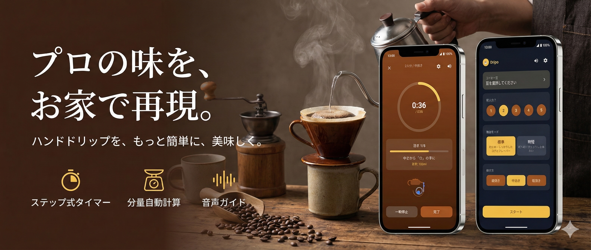

# Dripo: ハンドドリップコーヒータイマー

---

## 毎日のコーヒーに「再現性」を

**Dripo（ドリポ）** は、ハンドドリップを「再現性高く」淹れるためのステップ式タイマーアプリです。
蒸らしから抽出完了まで、タイミングと注湯量を画面と音でガイド。
「なんとなく」で淹れていたコーヒーが、狙った通りの味に変わります。

### 気分で選べる2つのモード

*   **標準モード**: しっかりしたコクとフレーバーを楽しみたい時に。
*   **時短モード**: すっきりした味わいで、忙しい朝にも最適。

### 面倒な計算はおまかせ

**人数（1〜5人分）** と **挽き目（細/中/粗）** を選ぶだけ。
アプリが自動で最適化します：
*   コーヒー豆の量 (g)
*   お湯の量 (ml)
*   抽出時間

---

## 主な機能

*   **ステップ式タイマー**: 「蒸らし」「注水」「落ちきり」の工程を迷わずナビゲート。
*   **目標湯量ガイド**: 各ステップで「何mlまで注ぐか」を表示。注ぎすぎを防ぎます。
*   **音声ガイド**: 手元を見ていても、次の動作を声で案内（設定でON/OFF可能）。
*   **履歴保存**: 抽出データに評価（★）とメモを残して保存。自分好みの設定が見つかります。
*   **豆の管理**: プリセットだけでなく、自分で買った豆の名前も登録可能。
*   **通知機能**: 音とバイブレーションで、重要なタイミングを逃しません。

---

## こんな方におすすめ

*   ハンドドリップを始めたばかりで、手順やタイミングに自信がない方
*   毎回の味を安定させたい、もっと美味しく淹れたい方
*   自分の豆や挽き目の好みを記録して、上達したい方
*   平日はサクッと、休日はじっくりこだわりたい方

