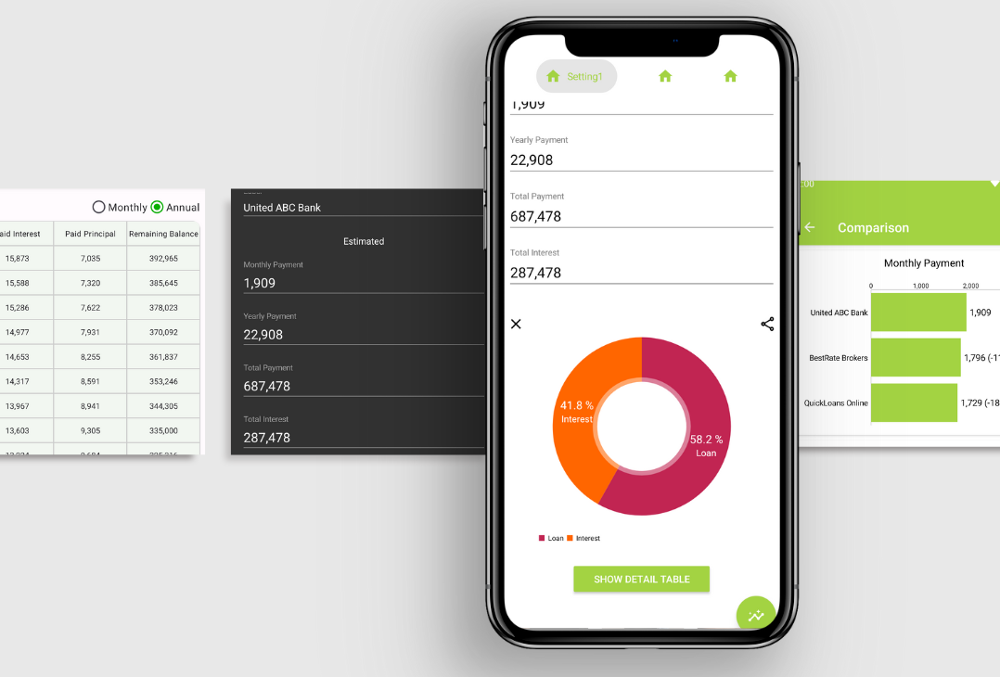
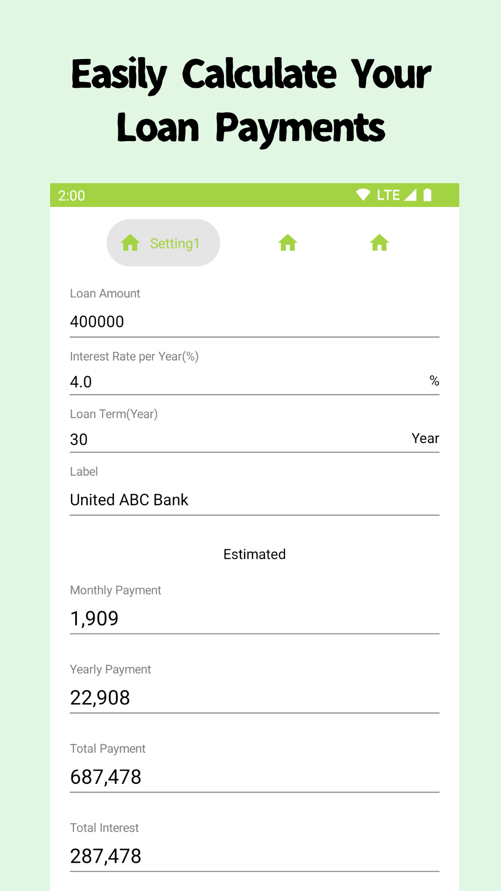
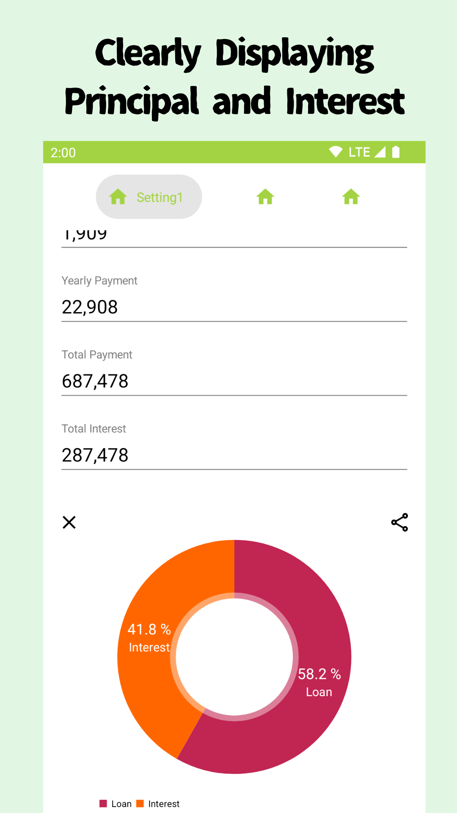
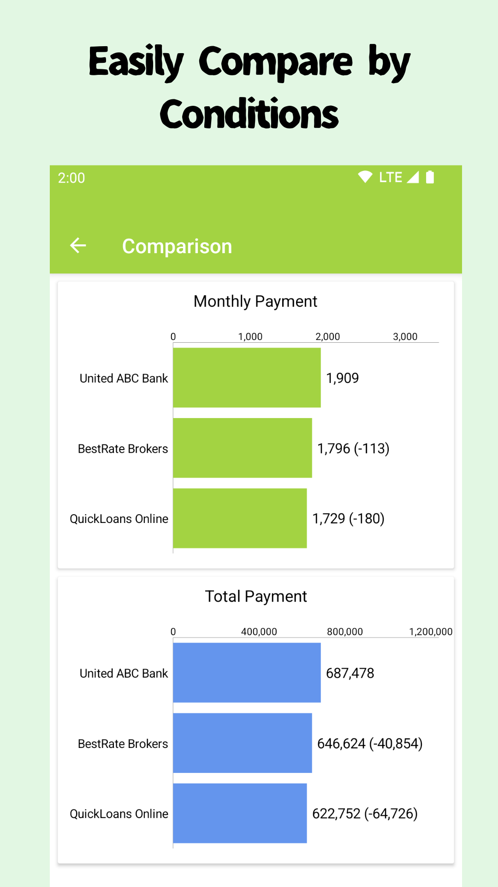
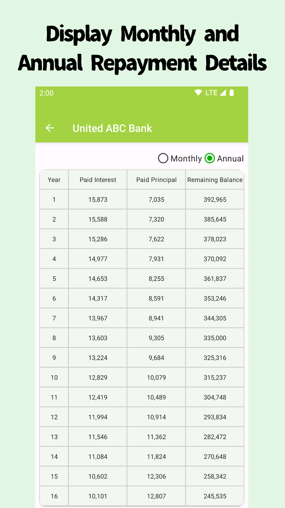
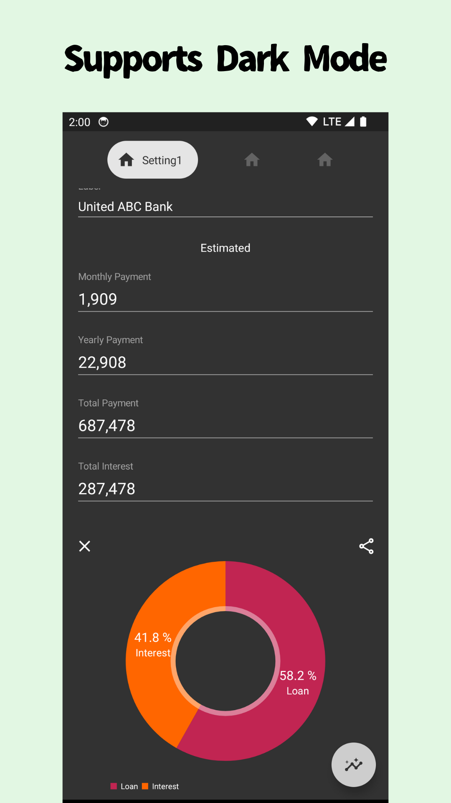

# Mortgage/Loan Calculator

|||
|---|---|
|||

---

You can check the monthly payments easily!

The Loan Calculator calculates the monthly payment, the amount of interest paid and the total payment.
The calculation results can be shared with your family or friends via email or SNS.

* Loan Calculator
* EMI Calculator
* Mortgage Calculator

* Loan Amount
* Interest Rate (%)
* Period (year)

---

The Mortgage/Loan Calculator is an essential tool for anyone dealing with loans or mortgages. It's designed to give you a detailed and accurate estimate of your monthly loan payments, encompassing both the principal and interest components.

Key Features:

- Monthly Payment Estimation: Understand exactly what you'll owe each month. Our calculator breaks down your payments, showing the split between principal and interest.

- Total Interest and Payment Calculation: Get a clear picture of the total interest you'll pay over the life of the loan, as well as the overall amount you'll spend.

- Comparison Tool: Visually compare various loan scenarios side by side. This feature is particularly useful for those considering refinancing or choosing between different loan offers.

- Refinancing Analysis: Assess the benefits of refinancing your loan with detailed comparisons.
User-Friendly Interface: Navigate the app with ease, thanks to its intuitive design.

- Versatility: Ideal for a wide range of users, from first-time homebuyers to those looking to refinance or manage their mortgage effectively.

Whether you're planning to buy a house, refinance an existing loan, or simply manage your finances more effectively, the Mortgage/Loan Calculator is here to simplify the process. It provides you with the clarity and detailed information needed to make informed financial decisions. Experience a stress-free loan management journey with our comprehensive and user-friendly app.

### ScreenShots:

