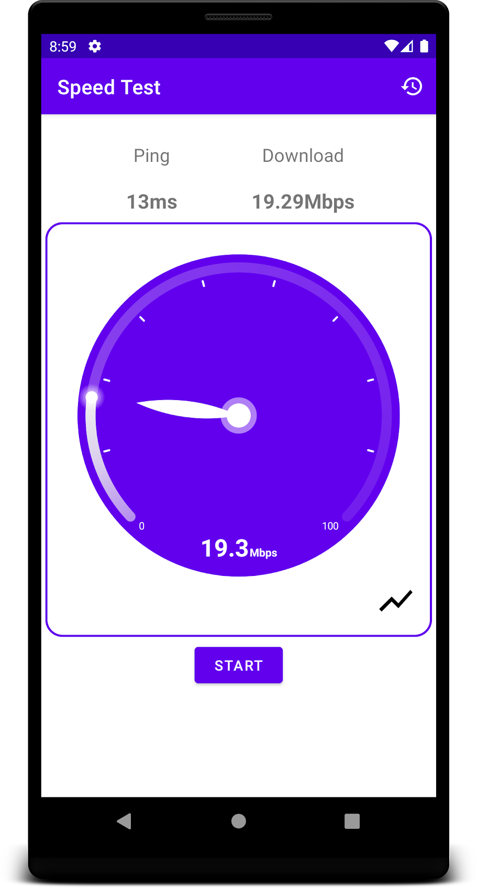
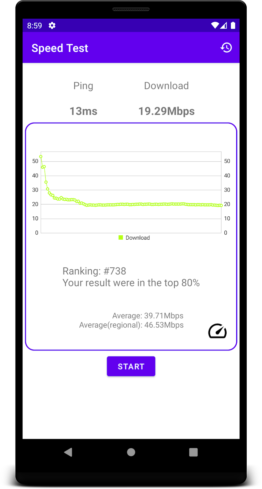
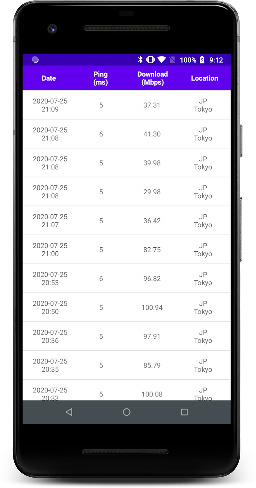

# Network Speed Test

---

With the Speed Test app, you can easily test the speed of your Internet connection.
It automatically searches for the best server and measures the speed and ping latency.
The measurement results are displayed as a chart, so you can also check the results visually.
You can find out your rank and average.

