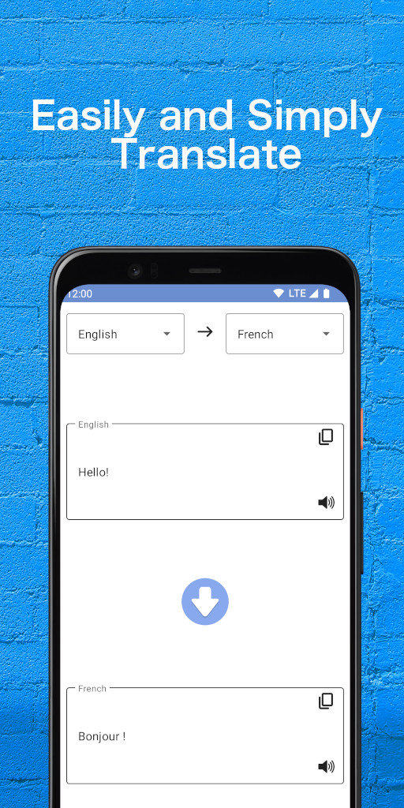
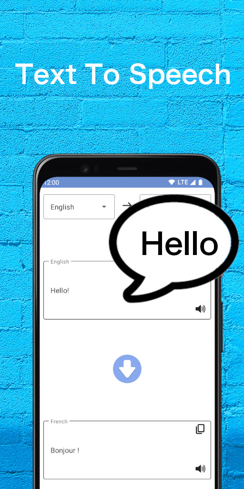
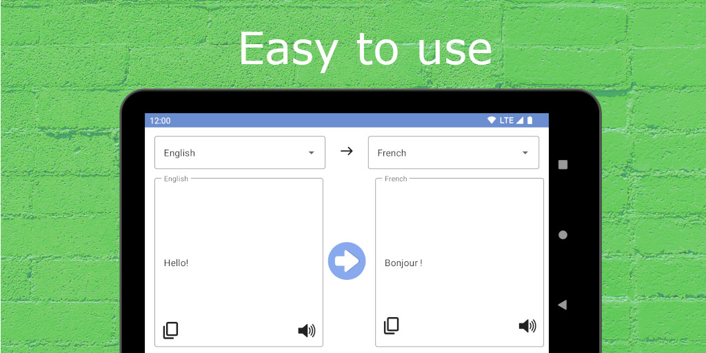

# Simple Translator

---

Simple Translator is a language translator app for text. You can easily translate into 10 languages by using our translator app for free. It also supports to read out the entered text.

||||
|---|---|---|
||||

---

<a href="/">Home</a>

